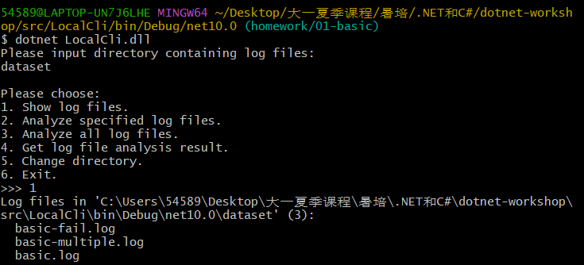
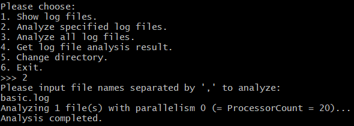
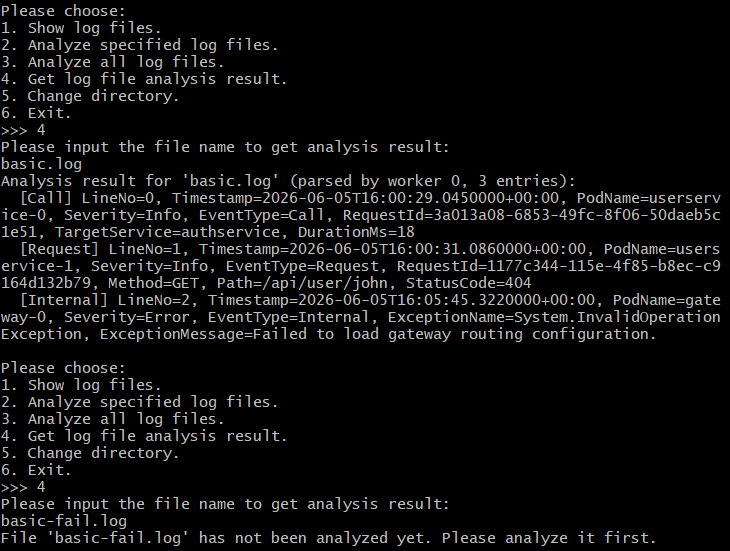
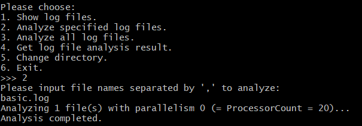
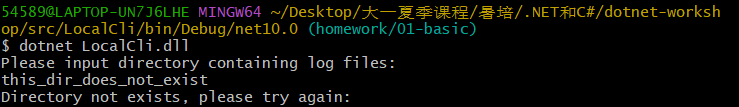
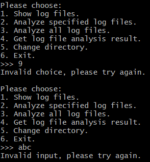
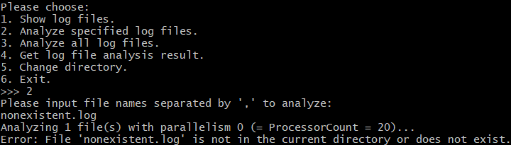
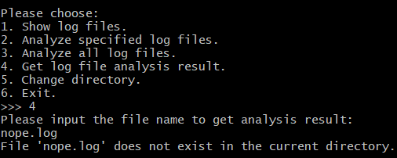

# 02-multithreading 实验报告

## 一、功能介绍

本节在 `01-basic` 的单文件日志解析基础上，实现了一个**目录级别的并行日志分析器**，并配有一个简易的交互式控制台界面。整体由三部分组成：

| 文件 | 任务 | 作用 |
| :--- | :--- | :--- |
| `LogAnalyzer/WorkQueue.cs` | T2.1 | 基于非线程安全 `Queue<T>` 自造的**线程安全阻塞队列** |
| `LogAnalyzer/LogFileAnalyzer.cs` | T2.2 | 扫描目录、调度多线程并行解析、保存结果 |
| `LocalCli/Program.cs` | T2.3 | 与用户交互的控制台菜单，串联上述能力 |

### 1. 线程安全队列 `WorkQueue<T>`（T2.1）

共享变量为内部的 `Queue<T> _items` 与「是否结束放入」标记 `_isCompleted`，两者统一用 `lock(_items)` 这同一个互斥量保护。这是一个带「结束放入」语义的无限容量生产者—消费者问题：

- `Enqueue`：加锁后入队，并 `Monitor.Pulse`（signal）唤醒一个等待中的消费者；若已 `CompleteAdding` 则抛 `InvalidOperationException`。
- `CompleteAdding`：置位 `_isCompleted`，并 `Monitor.PulseAll`（broadcast）唤醒**全部**正在等待的消费者，使其能够正常退出而不是永远阻塞。
- `TryDequeue`：加锁后用 **`while`** 循环判断「队列空 且 未结束」才 `Monitor.Wait`；被唤醒后重新检查条件。队列非空则取出返回 `true`，否则（空且已结束）返回 `false` 并把 `item` 置为 `default`。

### 2. 并行日志分析 `LogFileAnalyzer`（T2.2）

- **目录扫描**：`ChangeDirectory` 中 `Directory.EnumerateFiles(directoryPath, "*.log", SearchOption.TopDirectoryOnly)` 扫描当前目录下所有 `.log` 文件，并把每个文件以 `NotAnalyzed` 状态登记进 `_analysisResults`。
- **状态位 `_isAnalyzing`**：`AnalyzeFiles` 进入分析前置 `true`，在 `try/finally` 的 `finally` 里**加锁**复位为 `false`，保证异常时也能复位。该标志保证同一时刻只允许一个分析任务进行，其余并发请求抛 `InvalidOperationException`。
- **`RunWorkers`**：先把 `State == NotAnalyzed` 的文件筛选出来，跳过已 `Succeeded`/`Failed` 的文件以节省计算资源，未知文件抛 `InvalidOperationException`，用主线程作为生产者把待解析文件 `Enqueue` 进 `WorkQueue` 后 `CompleteAdding`；再开启 `degreeOfParallelism` 个 worker 线程（入口方法 `WorkerMain`），最后 `Join` 等待全部 worker 结束。
  - `degreeOfParallelism == 0` 表示取 `Environment.ProcessorCount`；并按 `[1, 文件数]` 夹取，避免开多余空转线程。
- **`WorkerMain`**：每个消费者循环 `TryDequeue` 取文件，用各自的 `LogFileParser` + `StreamReader` 解析；解析成功 → `Succeeded`，解析抛异常 → `Failed`（写 `ErrorMessage`、空 `Entries`）。最后**加 `_syncRoot` 锁**把结果写回共享的 `_analysisResults` 字典。
  - `parser.Parse(reader).ToList()` 中的 `ToList()` 用于强制立即求值：`Parse` 是 `yield return` 的惰性迭代器，若不立刻物化，异常会推迟到 `try` 之外才发生而无法被捕获。
- **`TryGetAnalysisResult`**：加锁查 `_analysisResults`，存在则返回 `true` 并输出结果，否则返回 `false`。

### 3. 控制台交互 `LocalCli/Program.cs`（T2.3）

菜单提供 6 个功能，`LogFileAnalyzer` 对错误输入，CLI 层把这些异常兜住并提示用户重新输入，保证非法输入不会让程序崩溃。

| 选项 | 功能 | 实现 |
| :--: | :--- | :--- |
| ——  | `InputDirectory` | 输入目录构造 `analyzer`；目录不存在→提示重输（`ChangeDirectory` 返回 `false`），路径非法→捕获 `ArgumentException` 提示重输 |
| 1 | `ShowLogFiles` | 调用 `GetLogFiles()` 列出目录中全部 `.log` 文件名 |
| 2 | `AnalyzeFiles` | 输入逗号分隔的文件名，`Split` 时去空白，调用 `AnalyzeFiles(0, ...)`；捕获 `ArgumentException`/`InvalidOperationException` |
| 3 | `AnalyzeAll` | 调用 `AnalyzeAll(0)` 分析全部；捕获 `InvalidOperationException` |
| 4 | `GetAnalysisResult` | 输入文件名查结果：不存在→提示；`NotAnalyzed`→提示先分析；`Succeeded`→用 `KeyValueVisitor.Dump` 逐条输出；`Failed`→输出 `ErrorMessage` |
| 5 | ChangeDirectory | 重新输入目录（复用 `InputDirectory`） |
| 6 | Exit | 退出 |

非法的菜单输入（非数字 / 超出范围）会被 `int.Parse` 的异常捕获或 `default` 分支拦截，提示重输，不会崩溃。

---

## 二、功能演示

### 启动 + 查看日志文件列表



### 分析指定文件



### 查看分析成功的结果，查询尚未分析的文件



### 分析全部 + 查看失败文件的错误信息 



---

## 三、鲁棒性测试

### 不存在的目录



### 非法的菜单输入



### 分析不存在的文件



### 查询不存在 / 未分析的文件



---

## 四、问答题

### (Q2.1)

共享变量有两个：

- `Queue<T> _items`：真正存放元素的内部队列；
- `bool _isCompleted`：标记是否已结束放入（`CompleteAdding` 是否被调用过）。

两者都通过**以 `_items` 这个引用对象本身作为互斥量**来保护——所有对它们的读写都放在 `lock(_items)` 临界区内：

```csharp
public void Enqueue(T item)
{
    lock (_items)
    {
        if (_isCompleted) throw new InvalidOperationException(...);
        _items.Enqueue(item);
        Monitor.Pulse(_items);
    }
}
```
同步关系（消费者等待 / 生产者唤醒）也建立在同一个 `_items` 上：消费者 `Monitor.Wait(_items)` 释放锁并休眠，生产者用 `Monitor.Pulse`（signal）/ `Monitor.PulseAll`（broadcast）唤醒。这是 C# `Monitor` 实现的 MESA 模型条件变量。

 `LogFileAnalyzer` 中的共享变量有：

- `string? _currentDirectory`：当前日志目录；
- `bool _isAnalyzing`：是否正在分析；
- `Dictionary<string, FileInfo> _logFiles`：文件名到 `FileInfo` 的映射；
- `Dictionary<string, AnalysisResult> _analysisResults`：文件名到分析结果的映射。

它们统一由一个专用的互斥量对象 `private readonly object _syncRoot = new();` 保护，所有访问都放在 `lock(_syncRoot)` 内（`ChangeDirectory`、`GetLogFiles`、`TryGetAnalysisResult`，以及 worker 写回结果时）：

```csharp
lock (_syncRoot)
{
    _analysisResults[file.Name] = result;
}
```

`RunWorkers` 中还有一个局部构造的 `WorkQueue<FileInfo>` 实例，被主线程（生产者）和各 worker（消费者）共享，但它由 `WorkQueue` **内部自己的 `_items` 锁**保护，属于另一套独立的互斥机制，与 `_syncRoot` 无关。`IsAnalyzing`、`IsCompleted` 等属性的 getter 也都通过加锁读取，避免读到未同步的值。

用 `if` 而非 `while` 在虚假唤醒下的后果：

以无限容量生产者—消费者为例，若消费者写成：

```csharp
lock (mtx)
{
    if (buffer == 0)        // 用 if
    {
        Monitor.Wait(mtx);
    }
    buffer -= 1;            // 直接取用商品
}
```

当发生虚假唤醒（`Wait` 在没有人 `Pulse` 的情况下自行返回）时：

- 线程被唤醒后**不再重新检查** `buffer == 0`，直接执行 `buffer -= 1`；
- 但此时 `buffer` 仍为 0（根本没生产出商品），于是「取走了一个不存在的商品」，`buffer` 变成 −1，状态不变量被破坏，出现逻辑错误。

更严重的是多消费者下的竞争：MESA 模型中，线程被 `Pulse` 唤醒后并不会立即拿到锁，而要重新去抢锁；在它重新拿到锁之前，另一个消费者可能已经把唯一的商品取走了（也可能是纯粹的虚假唤醒）。若用 `if`，这个被唤醒的消费者不会再检查条件，照样去取商品，于是出现「一个商品被消费两次」或「消费了空仓库」的错误。

而用 `while`：

```csharp
while (buffer == 0) { Monitor.Wait(mtx); }
```

被唤醒后会**再次判断条件**，若仓库仍为空（无论是虚假唤醒还是被别的消费者抢先），就继续 `Wait`，只有确实非空时才取用——这才是正确的。


### (Q2.2)

在 `ChangeDirectory` 方法中，这段代码完成了扫描：

```csharp
var logFiles = Directory.EnumerateFiles(directoryPath, "*.log", SearchOption.TopDirectoryOnly)
    .Select(filePath => Path.GetFileName(filePath))
    .OrderBy(fileName => fileName);
foreach (var fileName in logFiles)
{
    _logFiles.Add(fileName, new FileInfo(Path.Join(_currentDirectory, fileName)));
    _analysisResults.Add(fileName, new AnalysisResult(...));
}
```

其中真正「扫描目录里所有 `.log` 文件」的是 `Directory.EnumerateFiles(directoryPath, "*.log", SearchOption.TopDirectoryOnly)`：第一个参数是目录、第二个是匹配模式 `*.log`、第三个 `SearchOption.TopDirectoryOnly` 表示只扫描当前目录（不进入子目录）；后面的 `Select`/`OrderBy` 只是把得到的路径取出文件名并排序。

若要递归扫描所有子目录，把第三个参数改为 `SearchOption.AllDirectories`，即可让 `EnumerateFiles` 递归遍历所有子目录、子子目录……：

```csharp
Directory.EnumerateFiles(directoryPath, "*.log", SearchOption.AllDirectories)
```

一个需要注意的细节：当前代码用 `Path.GetFileName(filePath)`（仅文件名）作为 `_logFiles` / `_analysisResults` 的键。非递归时文件名不会重复，没有问题；但改为递归后，不同子目录下可能存在同名文件（例如两个子目录里都有 `20260701.log`），会造成字典键冲突、后扫到的覆盖先扫到的。因此递归版本更适合改用「相对路径」作为键，例如 `Path.GetRelativePath(directoryPath, filePath)`，以避免重名冲突。

### (Q2.3)

根据TODO框架和guidance.md完成任务××.AI能给出达成任务要求的代码并自行测试验证。有时候AI会有过度、无效兜底的问题，在这次作业中基本没有出现