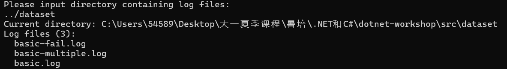
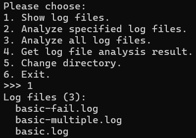
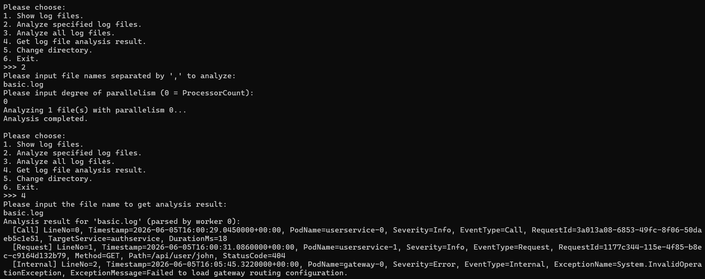
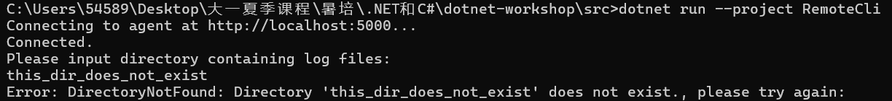
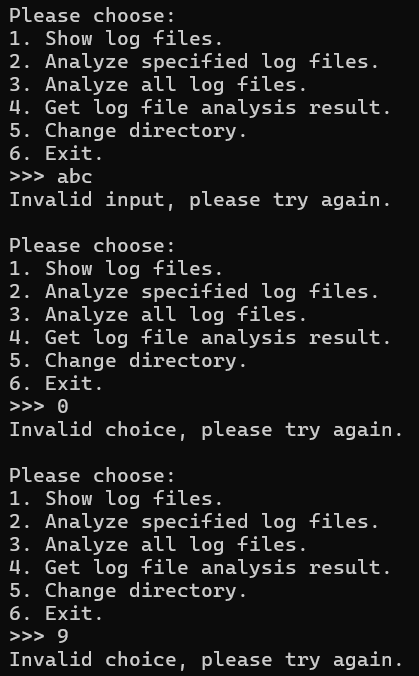
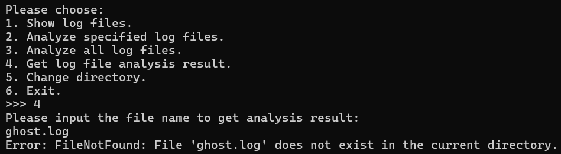
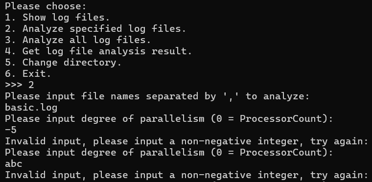
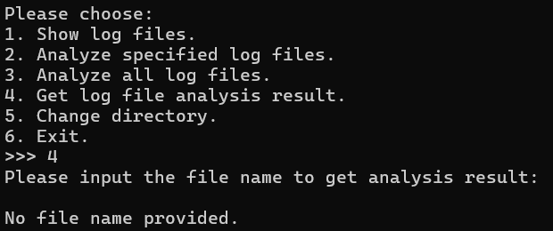

# 03-async-grpc 实验报告

## 一、T3.2 功能说明

`RemoteCli` 是一个对接 Agent gRPC 服务的远程控制台客户端，其交互逻辑与上一节的 `LocalCli` 基本一致，区别在于：所有对 `LogFileAnalyzer` 的本地函数调用都被替换为对应的 **异步 gRPC 调用**，即调用方法名带 `Async` 后缀的版本。

### 1. 实现的功能

| 菜单选项 | 功能 | 对应的 gRPC 异步调用 |
| :------: | :--- | :--- |
| 启动时 | 输入并切换日志目录 | `ChangeDirectoryAsync` |
| 1 | 列出当前目录中的日志文件 | `GetLogFilesAsync` |
| 2 | 解析指定的日志文件（可指定并行度） | `AnalyzeFilesAsync` |
| 3 | 解析当前目录中的全部日志文件 | `AnalyzeAllAsync` |
| 4 | 查询指定文件的分析结果（**流式**返回） | `GetAnalysisResult`（`ResponseStream.ReadAllAsync`） |
| 5 | 切换日志目录 | `ChangeDirectoryAsync` |
| 6 | 退出 | —— |

### 2. 关键实现要点

1. **全异步调用**：按照本节要求，所有 gRPC 调用均使用 `Async` 版本。对于流式接口 `GetAnalysisResult`，使用 `await foreach (var response in call.ResponseStream.ReadAllAsync())` 逐条读取服务端流式返回的 `GetAnalysisResultResponse`。

2. **流式结果的解析**：根据响应中的 `PayloadCase` 分别处理：
   - `Header`：根据 `State`（`NotAnalyzed` / `Failed` / `Succeeded`）给出对应的提示；只有 `Succeeded` 时才继续接收后续的日志条目。
   - `LogEntry`：通过 `GrpcTypeConverter.ConvertFromGrpc` 转回内部的 `LogEntry` 类型，再用 `KeyValueVisitor` 以键值对形式打印。

3. **切换目录后即时反馈**：利用 `ChangeDirectoryResponse` 中额外返回的 `current_directory` 与 `file_names` 字段，在切换目录成功后立刻打印 Agent 的完整路径与目录中的全部日志文件，方便确认。

4. **可配置并行度**：`AnalyzeFiles` / `AnalyzeAll` 在执行前会通过 `ReadDegreeOfParallelism` 让用户输入并行度（`0` 表示使用 `ProcessorCount`），通过 `ReadFileNames` 读取待解析的文件名列表。

5. **健壮性（重点）**：Agent 作为常驻服务，绝不应因用户非法输入或内部错误而崩溃。客户端同样做了充分的容错：
   - 所有 gRPC 调用均捕获 `RpcException`（网络层错误），输出友好提示而非崩溃。
   - 服务端返回的 `OperationStatusMessage` 中 `success == false` 时，将错误码与错误信息展示给用户，并允许其重新输入。
   - 菜单输入、并行度输入、文件名输入均做了非法值校验与重试。

### 3. 运行方式

需要**同时**运行 Agent（服务端）与 RemoteCli（客户端）两个程序：

1. **启动 Agent**：将 `LogAnalyzerAgent` 设为启动项目并运行（或在 `LogAnalyzerAgent` 目录下执行 `dotnet run`），它会在 `http://localhost:5000` 上监听 gRPC 服务。
2. **启动 RemoteCli**：运行 `RemoteCli`，默认连接 `http://localhost:5000`；也可通过命令行参数或环境变量 `LOG_ANALYZER_AGENT_ADDRESS` 指定 Agent 地址：

   ```bash
   dotnet run --project RemoteCli -- http://localhost:5000
   ```

---

## 二、功能演示截图

### 1. 连接 Agent 并切换目录



### 2. 列出日志文件（选项 1）



### 3. 解析指定文件并查看结果（选项 2 + 选项 4）



### 4. 解析全部文件并查看多日志文件结果（选项 3 + 选项 4）


---

## 三、鲁棒性测试截图

> 以下为各种非法输入情况下的运行截图，程序均能给出友好提示并继续运行，不会崩溃。

### 1. 非法目录名



### 2. 非法菜单选项



### 3. 查询不存在的文件



### 4. 解析不存在的文件

c:\Users\54589\AppData\Local\Temp\QQ_1785572383812.png

### 5. 非法并行度输入



### 6. 空文件名输入



---

## 四、问答题

### (Q3.1) 

**区别：**

1. **调用方式的本质变化**：非网络程序中，函数调用都是同进程内的本地调用，传参、返回都直接在内存中进行；而网络应用中，跨机器/跨进程的交互变成了远程过程调用（RPC）。表面上 `client.GetLogFilesAsync()` 看起来像普通方法，但背后实际上经历了一次完整的网络往返。
2. **数据需要序列化**：本地调用直接传递对象引用；网络调用则必须把数据序列化为字节流（本节中是 Protobuf），到达对端再反序列化。这就要求两端有一套共同的接口描述（IDL，即 `.proto` 文件），并且在内部 C# 类型与 Protobuf 消息类型之间编写转换层（本节的 `GrpcTypeConverter` / `GrpcLogEntryVisitor`）。
3. **必须采用异步编程模型**：网络 I/O 是典型的 I/O 密集场景，若用同步调用，线程会在等待网络响应时被白白阻塞。本节的 `RemoteCli` 因此全部使用 `async` / `await`，在等待响应时让出线程，这正是异步编程相比多线程的优势所在。
4. **需要同时启动、联合调试两个程序**：以往调试单个可执行文件即可；网络应用必须同时跑起服务端（Agent）和客户端（RemoteCli），且 Visual Studio 一次只能调试一个，另一个要手动启动，调试方式发生了变化。
5. **状态分布在多个进程**：Agent 是有状态的单例服务（保存当前目录、分析结果），客户端只是远程地读取/修改这些状态，状态不再集中在一个进程内。

**额外的难点：**

1. **网络不可靠**：连接可能失败、请求可能超时、对端可能宕机。必须捕获 `RpcException` 并做容错处理，而非像本地调用那样假定“调用了一定会返回”。本节的鲁棒性测试就体现了这一点。
2. **错误定位困难**：一次调用失败，可能是客户端参数错、可能是网络层、可能是序列化/反序列化、也可能是服务端逻辑。错误来源横跨两端，排查时需要分别查看客户端与服务端的输出，调试成本显著上升。
3. **类型系统的割裂与一致性维护**：两端可能用不同语言、不同类型表示同一概念。一旦 `.proto` 改动，两端的生成代码与转换逻辑都要同步更新，否则会出现字段对不上的隐蔽 bug。
4. **并发与共享状态的同步**：Agent 作为常驻服务，可能同时收到多个客户端请求，对共享状态（当前目录、分析结果）的访问需要加锁（本节的 `LogFileAnalyzer` 用 `_syncRoot` 保护），还要处理“分析进行中再次请求分析”这类并发冲突。
5. **部署与环境配置**：要关心端口、监听地址（`localhost` 仅本机、`0.0.0.0` 对外）、HTTP/2 协议、CORS、防火墙等，这些在非网络程序里几乎不存在。
6. **安全性**：网络服务暴露在外，需要考虑鉴权、传输加密、防止恶意请求与 DDoS 等，而本地程序一般无需考虑。

**额外的复杂之处：**

1. 需要额外学习并理解一整套协议栈知识：Protobuf 的消息定义与 `oneof`、gRPC 的四种调用模式（本节用到了服务端流式）、HTTP/2 等。
2. 需要理解依赖注入、服务注册等框架级概念（本节用 ASP.NET 的 `AddSingleton` 注册有状态服务），这对初学者是不小的认知负担。
3. 流式 RPC 的处理比一次性返回更复杂：要逐条读取、区分 `header` 与 `log_entry`、处理“文件不存在/未分析/失败/成功”等多种情形。
4. 调试反馈链路变长：改一处接口往往要重新生成代码、重启服务端、再重启客户端，迭代效率比单机程序低。

总的来说，网络应用的核心复杂度来自于**“分布”**二字——计算与状态被分散到了通过网络连接的不同节点上，由此衍生出序列化、异步、容错、并发、安全等一系列非网络程序所没有的问题。

### (Q2.2)

根据TODO框架和guidance.md完成任务××.AI能给出达成任务要求的代码并自行测试验证。有时候AI会有过度、无效兜底的问题，在这次作业中基本没有出现
